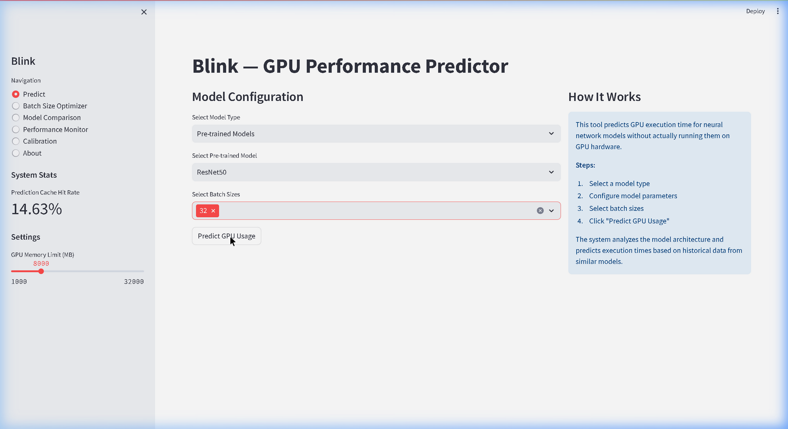
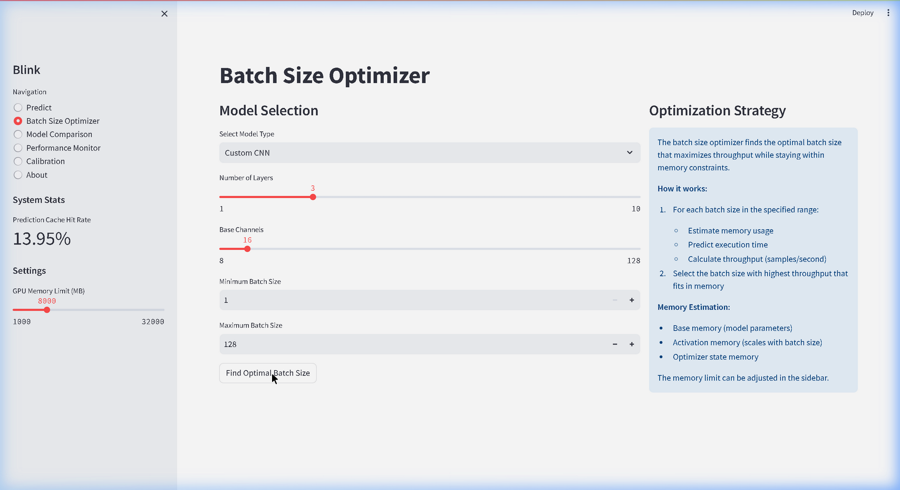

# Blink 🔭

[](https://badge.fury.io/py/blink-gpu)
[](https://github.com/Aniketxmishra/Blink_Main/actions/workflows/ci.yml)

[](https://opensource.org/licenses/Apache-2.0)
[](https://pepy.tech/projects/blink-gpu)

**Predict GPU execution time and memory usage of any PyTorch model — before you run it.**

Blink is a static GPU performance predictor for deep learning. Feed it a model architecture and batch size; get back latency and memory estimates in milliseconds — no GPU required at inference time. Built on XGBoost, Random Forest, and a Graph Neural Network that encodes the model's computational graph.

> 📄 Developed alongside a peer-reviewed research study on static and graph-based GPU performance prediction. Reproducibility scripts included.

---

## Why Blink?

Spinning up a GPU to profile every architecture variant is slow and expensive. Blink lets you:

- **Shift profiling left** — estimate GPU cost at design time, not deployment time
- **Optimize batch size** — find the largest batch that fits your memory budget without trial and error
- **Compare architectures instantly** — side-by-side latency and memory projections across model families
- **Explain predictions** — SHAP-powered breakdowns show exactly which architectural features drive cost

---

## Performance

Evaluated on held-out PyTorch model architectures:

| Metric | Model | MAPE |
|---|---|---|
| Execution Time | XGBoost | ~8% |
| Peak Memory | XGBoost | ~6% |

Confidence intervals on latency predictions are provided via quantile regression (Random Forest).

---

## Installation

```bash
# Core prediction API
pip install blink-gpu

# With Streamlit dashboard, SHAP explainability, and Plotly
pip install "blink-gpu[full]"

# With FastAPI REST server
pip install "blink-gpu[api]"

# Everything
pip install "blink-gpu[all]"
```

> PyTorch (`torch`, `torchvision`) must be installed separately per your CUDA setup.

---

## Quick Start

### Python API

```python
import torchvision.models as tv
from blink import BlinkPredictor, BlinkAnalyzer

model = tv.resnet50(weights=None)

# Inspect architecture
print(BlinkAnalyzer().summary(model))
# ➔ Parameters: 25,557,032 | FLOPs: 4,089 M | Conv layers: 53 | Size: 97.49 MB

# Predict for a single batch size
result = BlinkPredictor().predict(model, batch_size=32)
print(f"Exec time : {result['exec_time_ms']:.1f} ms")
print(f"Memory    : {result['memory_mb']:.1f} MB")
# ➔ Exec time: 28.5 ms | Memory: 294.5 MB

# Sweep across batch sizes
sweep = BlinkPredictor().predict_batch("resnet50", batch_sizes=[1, 8, 16, 32, 64])
```

### CLI

```bash
# Launch the REST API server
$ blink-serve

# Or run the package as a module for prediction
$ python -m blink predict resnet50 --batch-size 32

# Launch the Streamlit dashboard
$ python -m blink dashboard
```

---

## Dashboard

Run `blink dashboard` to launch the Streamlit interface:

- **Live Predictions** — predict any TorchVision model or paste custom PyTorch code
- **SHAP Explainability** — waterfall charts showing which features (FLOPs, depth, Conv layers) drove each prediction
- **Batch Optimizer** — find the maximum batch size within a given GPU memory budget (8 GB, 16 GB, 24 GB, etc.)
- **Architecture Comparison** — side-by-side performance breakdown across models




---

## REST API & Docker

Deploy Blink as a microservice with one command:

```bash
git clone https://github.com/Aniketxmishra/Blink_Main.git
cd Blink_Main
docker compose up -d
```

| Service | URL |
|---|---|
| Dashboard | `http://localhost:8501` |
| REST API (Swagger) | `http://localhost:8000/docs` |

```bash
curl -X POST "http://localhost:8000/api/v2/predict" \
     -H "Content-Type: application/json" \
     -d '{"model_name": "resnet50", "batch_size": 32}'
```

```json
{
  "model_name": "resnet50",
  "batch_size": 32,
  "predictions": {
    "exec_time_ms": 28.45,
    "exec_time_bounds": [22.1, 36.6],
    "memory_usage_mb": 294.5
  }
}
```

---

## How It Works

```
PyTorch Model
      │
      ▼
┌──────────────────────┐
│   Feature Extraction │  ← layer counts, FLOPs, params, depth, width, skip connections
│   + GNN Encoding     │  ← graph-based architecture encoding (ArchitectureGNN)
└──────────┬───────────┘
           │
           ▼
┌──────────────────────┐
│   Prediction Stack   │
│  ──────────────────  │
│  XGBoost             │  ← primary predictor + SHAP explainability
│  Random Forest       │  ← quantile regression for confidence intervals
│  GNN Predictor       │  ← graph-native, generalizes across architecture families
└──────────┬───────────┘
           │
           ▼
    exec_time_ms, memory_mb
```

---

## Reproducing the Paper

All figures and ablation results from the research paper can be reproduced:

```bash
git clone https://github.com/Aniketxmishra/Blink_Main.git
cd Blink_Main
pip install -e ".[full]"

python scripts/ablation_study.py
python scripts/generate_paper_figures.py
# Outputs saved to results/
```

---

## License

Apache 2.0 — see [LICENSE](LICENSE) for details.

Built by [Aniket Mishra](https://github.com/Aniketxmishra) · [PyPI](https://pypi.org/project/blink-gpu/)
